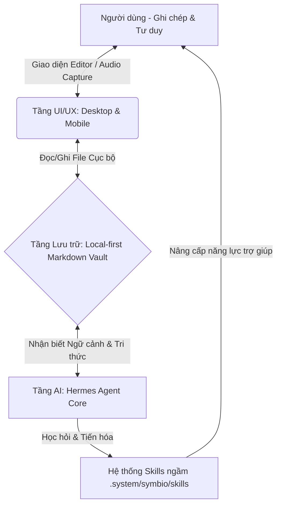

# 🧠 Symbio: Next-Gen Personal Knowledge OS

> **Symbio** phản ánh chính xác bản chất cao nhất của dự án: Một mối quan hệ **cộng sinh dữ liệu (Data Symbiosis)** hoàn hảo — con người nuôi dưỡng AI bằng tri thức, và AI tiến hóa để nâng tầm tư duy của con người.

---

## 🌟 Tầm nhìn & Triết lý Cốt lõi

Hầu hết các công cụ ghi chú hiện tại chỉ là "kho chứa dữ liệu tĩnh" (static silos), đòi hỏi người dùng phải chủ động sắp xếp thủ công. Ngược lại, các chatbot AI phổ biến lại bị "mất trí nhớ" (context window limit) sau mỗi phiên làm việc, không tích lũy được tri thức của bạn qua thời gian.

**Symbio** phá vỡ giới hạn này bằng cách tạo ra một **vòng lặp cộng sinh khép kín**:
1. **Bạn ghi chép để tư duy:** Viết tự do dưới dạng Markdown.
2. **AI (Symbiotic Entity) tiếp nhận & thấu hiểu:** Tự động kết nối, gắn thẻ, và tìm kiếm ngữ nghĩa.
3. **AI tự tiến hóa kỹ năng:** Tích hợp framework agent tự cải thiện, tự lập trình thêm các "Skills" mới để hỗ trợ công việc của bạn hiệu quả hơn.

Càng sử dụng, Symbio càng hiểu sâu sắc chủ nhân của nó, biến việc ghi chú từ hành động lưu trữ thụ động thành quá trình đối thoại và đồng sáng tạo chủ động.

---

## 🏗️ Các Trụ cột Kiến trúc Kỹ thuật



### 1. 📁 Tầng Lưu trữ: Local-First & Cloud-Agnostic
* **Độc lập và Riêng tư:** Dữ liệu cốt lõi là các file phẳng **Markdown (`.md`)** lưu trữ cục bộ trên thiết bị của bạn. Bạn sở hữu hoàn toàn tri thức của mình, không bị khóa vào bất kỳ nhà cung cấp dịch vụ đám mây nào (vendor lock-in).
* **Đồng bộ đám mây tự do:** Tương thích hoàn hảo với các thư mục đồng bộ đám mây cá nhân như **iCloud Drive**, **Google Drive** hoặc **OneDrive**. Bạn có thể chỉnh sửa trực tiếp trên điện thoại hoặc máy tính mà không cần qua máy chủ trung gian của Symbio.

### 2. 🧠 Tầng AI: Động cơ Hermes Agent & Vòng lặp Tự học
* **Trí nhớ dài hạn bền vững:** Sử dụng **Local Vector Database** (như ChromaDB/FAISS/LanceDB) kết hợp với các mô hình LLM tiên tiến (Gemini API thông qua Google AI Studio cho ngữ cảnh lớn và chi phí thấp, hoặc Ollama cho bảo mật cục bộ 100%).
* **Cơ chế Tự tiến hóa (Self-Improving Skills):** Ứng dụng triết lý của **Hermes Agent**. Khi bạn yêu cầu thực hiện một tác vụ phức tạp (ví dụ: "Tóm tắt xu hướng công nghệ từ các ghi chú tuần qua và tạo danh sách việc cần làm"), Agent sẽ tự viết mã nguồn hoặc cấu trúc hóa hành động thành các file kỹ năng dạng `.md` nằm trong thư mục `.system/symbio/skills/`. Kỹ năng này sẽ được tái sử dụng và tối ưu hóa dần theo thời gian.

---

## 🎨 Trải nghiệm Người dùng (UX/UI)

* **Ứng dụng Desktop (Tauri + Rust/React):** 
  - Siêu nhẹ, khởi động tức thì, hoạt động mượt mà trên bộ nhớ RAM tối thiểu.
  - Trình soạn thảo WYSIWYG Editor tối giản, tập trung tối đa vào luồng viết (flow).
  - Sidebar AI Companion luôn sẵn sàng hỗ trợ, gợi ý liên kết trực quan.
* **Ứng dụng Mobile (React Native):**
  - Gọn gàng, tập trung vào việc ghi chú nhanh (Quick Capture).
  - Chuyển đổi giọng nói thành văn bản thông minh (Voice-to-Text) khi bạn đang di chuyển.
  - Đồng bộ thời gian thực thông qua hệ thống file đám mây cá nhân.
* **Tính năng AI Vô hình (Invisible AI):**
  - **Auto-tagging:** Tự động đề xuất thẻ phù hợp dựa trên nội dung ghi chú.
  - **Auto-linking:** Gợi ý kết nối đến các ghi chú có chủ đề liên quan để tạo nên mạng lưới tri thức (Knowledge Graph).
  - **Semantic Search:** Tìm kiếm theo ý niệm/ý đồ của bạn thay vì chỉ tìm các từ khóa khớp chính xác.

---

## 🗺️ Lộ trình Phát triển (MVP Focus)

Hành trình xây dựng Symbio được chia thành 4 giai đoạn cốt lõi để đảm bảo khả năng mở rộng với chỉ **một nhân sự phát triển (Solopreneur)**:

| Giai đoạn | Tên Giai đoạn | Mục tiêu chính | Chi tiết triển khai |
| :--- | :--- | :--- | :--- |
| **Phase 1** | **Hạt nhân (Core CLI)** | Kết nối Markdown Vault với Hermes Agent | Viết script Python/Rust, thiết lập Vector DB cục bộ, cấu hình Prompting & Skill Generation. |
| **Phase 2** | **Vỏ bọc (Desktop App)** | Ra mắt ứng dụng Desktop đầu tiên | Dựng UI bằng Tauri + React, tích hợp Editor cơ bản và Sidebar AI hỗ trợ. |
| **Phase 3** | **Mở rộng (Mobile & Sync)** | Hoàn thiện hệ sinh thái đa nền tảng | Phát triển App React Native, tối ưu hóa đồng bộ qua iCloud/Google Drive, mở rộng cộng đồng. |
| **Phase 4** | **Cổng kết nối MCP (Cổng phụ)**| Tích hợp vào Claude/Antigravity | Xây dựng MCP Server wrapper, hỗ trợ người dùng Pro sử dụng trực tiếp qua Claude Desktop/Cursor. |

---

## 📁 Cấu trúc Thư mục Dự kiến

```text
symbio/
├── .github/             # GitHub actions & templates
├── docs/                # Tài liệu thiết kế & Hướng dẫn bắt đầu
│   └── GETTING_STARTED.md
├── vault/               # Thư mục ghi chú Markdown mẫu của người dùng
│   ├── .system/         # Cấu hình hệ thống ngầm của Symbio
│   │   └── skills/      # Nơi lưu trữ các kỹ năng tự tiến hóa của Agent
│   └── Inbox/           # Nơi chứa các ghi chú nhanh mới ghi lại
├── agent/               # Mã nguồn của động cơ Hermes Agent (Python/Rust CLI)
└── src/                 # Mã nguồn ứng dụng giao diện (Tauri Desktop App)
```

---

## 🤝 Liên hệ & Đóng góp
Dự án được phát triển với tinh thần mã nguồn mở và hướng tới quyền riêng tư dữ liệu tuyệt đối. 

* **Developer:** [Your Name/Github]
* **License:** MIT License
