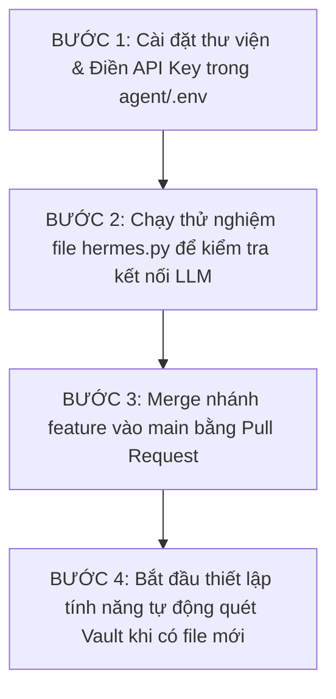

# 📊 BẢNG THEO DÕI TIẾN ĐỘ & LỘ TRÌNH DỰ ÁN (SYMBIO STATUS DASHBOARD)

Tài liệu này ghi nhận trạng thái hiện tại của dự án Symbio, danh sách các công việc đã hoàn thành, đang thực hiện, và kế hoạch tiếp theo. Đây là "nguồn sự thật duy nhất" về tiến độ để bạn luôn nắm được chúng ta đang ở đâu.

---

## 📌 Trạng Thái Hiện Tại
* **Nhánh Git hiện tại:** `feature/issue-1-agent-foundation` (Nhánh tính năng hạt nhân AI).
* **Trạng thái nhánh main:** Đã khóa trên GitHub (đảm bảo an toàn, chỉ merge qua PR).
* **Mức độ hoàn thành MVP:** **~35%** (Hạt nhân AI cơ bản đã code xong và sẵn sàng chạy thử nghiệm).

---

## 🗺️ Bảng Lộ Trình & Trạng Thái Chi Tiết

### 🛠️ Giai Đoạn 0: Thiết lập & Quy trình hoạt động (Hoàn thành 100%)
Giai đoạn xây dựng quy tắc hoạt động cho dự án và thiết lập môi trường.

| Công việc | Chi tiết triển khai | File liên quan | Trạng thái |
| :--- | :--- | :--- | :--- |
| **Quy tắc phân nhánh & PR** | Ngăn commit trực tiếp vào main, quy định nhánh feature | [.agents/AGENTS.md](file:///Users/hoanhk5/Documents/khbis_github/symbio/.agents/AGENTS.md) | ✅ Hoàn thành |
| **Tự động hóa CLI Github** | Kỹ năng tạo Issue, Branch, PR cho Agent | [github-workflow/SKILL.md](file:///Users/hoanhk5/Documents/khbis_github/symbio/.agents/skills/github-workflow/SKILL.md) | ✅ Hoàn thành |
| **Bản tóm lược dự án** | Khái niệm hóa ý tưởng Symbio, các trụ cột kỹ thuật | [README.md](file:///Users/hoanhk5/Documents/khbis_github/symbio/README.md) | ✅ Hoàn thành |
| **Hướng dẫn bắt đầu** | Tài liệu cấu hình môi trường và chọn stack | [docs/GETTING_STARTED.md](file:///Users/hoanhk5/Documents/khbis_github/symbio/docs/GETTING_STARTED.md) | ✅ Hoàn thành |
| **Quản lý dependencies** | Cấu hình cài đặt thư viện bằng `uv` hoặc `venv` | [agent/requirements.txt](file:///Users/hoanhk5/Documents/khbis_github/symbio/agent/requirements.txt) | ✅ Hoàn thành |

---

### 🧠 Giai Đoạn 1: Hạt nhân AI - CLI (`agent/`) (Đang thực hiện - Hoàn thành 75%)
Giai đoạn kết nối thư mục ghi chú Markdown của người dùng với AI Agent (Hermes).

| Công việc | Chi tiết triển khai | File liên quan | Trạng thái |
| :--- | :--- | :--- | :--- |
| **Hệ thống Cấu hình** | Đọc các biến môi trường, thiết lập thư mục tự sinh ngầm | [agent/config.py](file:///Users/hoanhk5/Documents/khbis_github/symbio/agent/config.py) | ✅ Đã code & biên dịch |
| **Cơ sở dữ liệu Vector** | Kết nối LanceDB, tạo bảng chỉ mục notes & skills, viết hàm sinh embeddings | [agent/db.py](file:///Users/hoanhk5/Documents/khbis_github/symbio/agent/db.py) | ✅ Đã code & biên dịch |
| **Bộ đọc Kỹ năng (Skills)** | Regex phân tích YAML frontmatter, đồng bộ hóa skills vào DB | [agent/skills.py](file:///Users/hoanhk5/Documents/khbis_github/symbio/agent/skills.py) | ✅ Đã code & biên dịch |
| **Động cơ Agent (Hermes)** | Ráp nối context notes, instructions và gọi API LLM | [agent/hermes.py](file:///Users/hoanhk5/Documents/khbis_github/symbio/agent/hermes.py) | ✅ Đã code & biên dịch |
| **Chạy thử nghiệm & Debug** | Nhập API Key (Gemini hoặc Ollama), chạy thực tế CLI | [agent/hermes.py](file:///Users/hoanhk5/Documents/khbis_github/symbio/agent/hermes.py) | ✅ Hoàn thành |
| **Khung kiểm thử (Test Harness)** | Thiết lập pytest và sandbox test suite để kiểm nghiệm DB, config, skills, và hooks | [agent/tests/](file:///Users/hoanhk5/Documents/khbis_github/symbio/agent/tests/) | ✅ Hoàn thành |
| **Script Tự động hóa quét Vault**| Lập lịch định kỳ tự động quét file Markdown mới để nạp vào DB | `agent/watcher.py` | 📥 Chưa bắt đầu |

---

### 💻 Giai Đoạn 2: Giao Diện Desktop (Tauri + React) (Chưa bắt đầu)
Đóng gói hạt nhân CLI thành phần mềm Desktop siêu nhẹ.

| Công việc | Chi tiết triển khai | Trạng thái |
| :--- | :--- | :--- |
| **Khởi tạo dự án Tauri** | Thiết lập Rust backend và React frontend | 📥 Chưa bắt đầu |
| **Xây dựng WYSIWYG Editor** | Trình soạn thảo Markdown tối giản, mượt mà | 📥 Chưa bắt đầu |
| **AI Sidebar Companion** | Sidebar trò chuyện với Hermes Agent, hiển thị ý nghĩ `<thought>` | 📥 Chưa bắt đầu |
| **Tương tác File local qua Tauri** | Gọi code Python hạt nhân hoặc Rust sidecar để đọc/ghi file trực tiếp | 📥 Chưa bắt đầu |

---

### 📱 Giai Đoạn 3: Ứng Dụng Di Động & Đồng Bộ Đám Mây (Chưa bắt đầu)

| Công việc | Chi tiết triển khai | Trạng thái |
| :--- | :--- | :--- |
| **Khởi tạo app Expo** | Tạo dự án React Native Expo | 📥 Chưa bắt đầu |
| **Tương tác tệp tin** | Tích hợp thư viện đọc/ghi file từ thư mục iCloud / Google Drive | 📥 Chưa bắt đầu |
| **Tính năng Quick Capture** | Soạn ghi chú nhanh gọn, ghi âm chuyển giọng nói thành văn bản | 📥 Chưa bắt đầu |

---

### 🔌 Giai Đoạn 4: Tích Hợp Giao Thức MCP (Cổng Kết Nối Phụ) (Chưa bắt đầu)
Xây dựng lớp bọc MCP (MCP Wrapper) để tích hợp vào các công cụ trò chuyện AI sẵn có.

| Công việc | Chi tiết triển khai | Trạng thái |
| :--- | :--- | :--- |
| **Xây dựng MCP Server** | Tạo module `mcp_server.py` kết nối CLI lõi với SDK MCP chính thức | 📥 Chưa bắt đầu |
| **Khai báo Tools** | Đăng ký các công cụ đọc/ghi note và gọi skill với MCP Client | 📥 Chưa bắt đầu |
| **Tích hợp Claude/Antigravity** | Cấu hình tệp `mcp_config.json` để chạy thử nghiệm thực tế | 📥 Chưa bắt đầu |

---

## 📋 Trình Tự Thực Hiện Tiếp Theo (Next Action Items)

Để tiếp tục đẩy dự án đi đúng hướng, đây là trình tự việc chúng ta cần làm:

1. **Bước 1 (Do Bạn thực hiện):** Cài đặt môi trường ảo (bằng `uv` hoặc `venv`), copy `.env.example` thành `.env` và điền `GEMINI_API_KEY` (hoặc cấu hình chạy local bằng Ollama).
2. **Bước 2 (Cùng thực hiện):** Chạy thử file `hermes.py` để xem AI trả lời, sửa lỗi nếu phát sinh kết nối API.
3. **Bước 3 (Do Bạn thực hiện):** Tạo PR trên GitHub để merge nhánh `feature/issue-1-agent-foundation` vào nhánh `main` (vì nhánh `main` đã được bạn khóa, việc này giúp code nền tảng được lưu trữ an toàn).
4. **Bước 4 (Cùng thực hiện):** Tạo một Issue mới để bắt đầu thiết lập chức năng tự động theo dõi thư mục (file watcher) nhằm nạp dữ liệu Markdown vào Vector DB tự động mỗi khi bạn lưu ghi chú.
